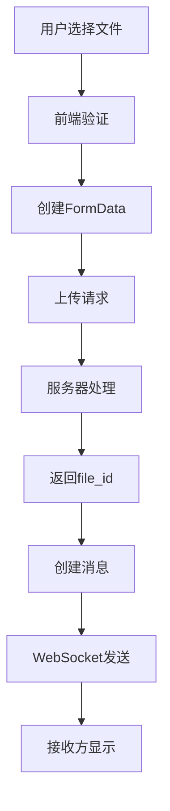

# File模块开发文档

## 概述

本文档为echat_web聊天应用设计完整的文件模块，包含文件上传、下载、缓存和显示等功能。该模块采用Vue3 + TypeScript + Pinia架构，遵循项目的四层架构模式。

---

## 一、Web文件上传与传输机制

### 1.1 基础概念与流程

#### HTTP文件上传原理

Web文件上传通过HTTP协议的`multipart/form-data`格式实现，该格式允许在一个请求中传输多种类型的数据：

```http
POST /auth/file/upload HTTP/1.1
Content-Type: multipart/form-data; boundary=----WebKitFormBoundary7MA4YWxkTrZu0gW

------WebKitFormBoundary7MA4YWxkTrZu0gW
Content-Disposition: form-data; name="file"; filename="example.jpg"
Content-Type: image/jpeg

[文件二进制数据]
------WebKitFormBoundary7MA4YWxkTrZu0gW
Content-Disposition: form-data; name="fileName"

示例图片
------WebKitFormBoundary7MA4YWxkTrZu0gW--
```

#### 文件传输完整流程



### 1.2 技术实现细节

#### FormData封装

```typescript
// src/service/fileService.ts
export const createFileFormData = (
  file: File,
  metadata?: FileUploadMetadata
): FormData => {
  const formData = new FormData()

  // 添加文件本身
  formData.append('file', file)

  // 添加文件元数据
  formData.append('fileName', metadata?.fileName || file.name)
  formData.append('fileType', metadata?.fileType || getFileType(file))

  // 添加业务上下文
  if (metadata?.context) {
    formData.append('context', JSON.stringify(metadata.context))
  }

  return formData
}
```

#### 文件类型识别

```typescript
// src/utils/fileUtils.ts
export const FILE_TYPE_MAP = {
  image: ['jpg', 'jpeg', 'png', 'gif', 'webp', 'svg', 'bmp', 'ico'],
  document: ['pdf', 'doc', 'docx', 'xls', 'xlsx', 'ppt', 'pptx', 'txt'],
  video: ['mp4', 'mov', 'avi', 'wmv', 'flv', 'webm', 'mkv'],
  audio: ['mp3', 'wav', 'ogg', 'aac', 'flac', 'm4a'],
  archive: ['zip', 'rar', '7z', 'tar', 'gz'],
  code: ['js', 'ts', 'html', 'css', 'json', 'xml', 'py', 'java', 'cpp']
}

export const getFileType = (file: File): string => {
  const extension = file.name.split('.').pop()?.toLowerCase()

  for (const [type, extensions] of Object.entries(FILE_TYPE_MAP)) {
    if (extensions.includes(extension || '')) {
      return type
    }
  }

  return 'unknown'
}
```

#### 上传进度监控

```typescript
// src/composables/useFileUpload.ts
export const useUploadProgress = () => {
  const uploadProgress = ref<Map<string, number>>(new Map())

  const updateProgress = (fileId: string, progress: number) => {
    uploadProgress.value.set(fileId, progress)
  }

  const getProgress = (fileId: string): number => {
    return uploadProgress.value.get(fileId) || 0
  }

  const clearProgress = (fileId: string) => {
    uploadProgress.value.delete(fileId)
  }

  return {
    uploadProgress: readonly(uploadProgress),
    updateProgress,
    getProgress,
    clearProgress
  }
}
```

### 1.3 安全机制

#### 文件验证

```typescript
// src/utils/fileValidation.ts
export const FileValidator = {
  // 文件类型白名单验证
  validateType(file: File, allowedTypes: string[]): boolean => {
    const fileType = getFileType(file)
    return allowedTypes.includes(fileType)
  },

  // 文件大小验证
  validateSize(file: File, maxSize: number): boolean => {
    return file.size <= maxSize
  },

  // 文件名安全处理
  sanitizeFileName(fileName: string): string {
    // 移除危险字符
    return fileName
      .replace(/[<>:"/\\|?*]/g, '_')
      .replace(/^\./, '_')
      .slice(0, 255)
  },

  // MIME类型验证
  validateMimeType(file: File, allowedMimeTypes: string[]): boolean {
    return allowedMimeTypes.includes(file.type)
  }
}
```

---

## 二、Pinia文件缓存方案

### 2.1 缓存架构设计

#### FileStore状态结构

```typescript
// src/stores/fileStore.ts
import { defineStore } from 'pinia'
import type { FileMetadata, FileCache, UploadTask } from '@/types/file'

export const useFileStore = defineStore('file', () => {
  // 状态定义
  const fileCache = ref<Map<string, FileCache>>(new Map())
  const uploadTasks = ref<Map<string, UploadTask>>(new Map())
  const downloadTasks = ref<Map<string, DownloadTask>>(new Map())

  // 配置
  const config = ref({
    cacheLimit: 100 * 1024 * 1024, // 100MB
    maxCachedFiles: 100,
    enablePreview: true,
    thumbnailQuality: 0.8
  })

  // 当前缓存大小
  const currentCacheSize = computed(() => {
    let total = 0
    for (const cache of fileCache.value.values()) {
      total += cache.size || 0
    }
    return total
  })

  // 获取缓存的文件
  const getFile = (fileId: string): FileCache | undefined => {
    const cache = fileCache.value.get(fileId)
    if (cache) {
      // 更新访问时间（LRU算法）
      cache.lastAccess = Date.now()
      cache.accessCount++
    }
    return cache
  }

  // 添加文件到缓存
  const cacheFile = (fileId: string, cache: FileCache) => {
    // 检查缓存空间
    if (currentCacheSize.value + cache.size > config.value.cacheLimit) {
      cleanupOldestCache(cache.size)
    }

    // 检查文件数量限制
    if (fileCache.value.size >= config.value.maxCachedFiles) {
      cleanupLeastUsedCache()
    }

    fileCache.value.set(fileId, {
      ...cache,
      lastAccess: Date.now(),
      accessCount: 1
    })
  }

  // 清理最旧的缓存
  const cleanupOldestCache = (requiredSpace: number) => {
    const entries = Array.from(fileCache.value.entries())
      .sort(([, a], [, b]) => a.lastAccess - b.lastAccess)

    let freedSpace = 0
    for (const [fileId, cache] of entries) {
      fileCache.value.delete(fileId)
      freedSpace += cache.size || 0

      if (freedSpace >= requiredSpace) break
    }
  }

  // 清理最少使用的缓存
  const cleanupLeastUsedCache = () => {
    const entries = Array.from(fileCache.value.entries())
      .sort(([, a], [, b]) => a.accessCount - b.accessCount)

    // 删除最少使用的10%文件
    const deleteCount = Math.ceil(entries.length * 0.1)
    for (let i = 0; i < deleteCount; i++) {
      const [fileId] = entries[i]
      fileCache.value.delete(fileId)
    }
  }

  // 清理所有缓存
  const clearCache = () => {
    // 释放Blob URL
    for (const cache of fileCache.value.values()) {
      if (cache.blobUrl) {
        URL.revokeObjectURL(cache.blobUrl)
      }
    }
    fileCache.value.clear()
  }

  return {
    // 状态
    fileCache: readonly(fileCache),
    uploadTasks: readonly(uploadTasks),
    downloadTasks: readonly(downloadTasks),
    currentCacheSize,

    // 方法
    getFile,
    cacheFile,
    clearCache
  }
})
```

### 2.2 缓存策略实现

#### LRU缓存算法

```typescript
// src/utils/cacheUtils.ts
export class LRUCache<K, V> {
  private cache = new Map<K, { value: V; timestamp: number }>()
  private maxSize: number

  constructor(maxSize: number = 100) {
    this.maxSize = maxSize
  }

  get(key: K): V | undefined {
    const item = this.cache.get(key)
    if (item) {
      // 更新访问时间
      item.timestamp = Date.now()
      return item.value
    }
    return undefined
  }

  set(key: K, value: V): void {
    // 如果已存在，更新并调整顺序
    if (this.cache.has(key)) {
      this.cache.set(key, { value, timestamp: Date.now() })
      return
    }

    // 检查容量限制
    if (this.cache.size >= this.maxSize) {
      // 删除最旧的项目
      const oldestKey = this.getOldestKey()
      if (oldestKey) {
        this.cache.delete(oldestKey)
      }
    }

    this.cache.set(key, { value, timestamp: Date.now() })
  }

  private getOldestKey(): K | undefined {
    let oldestKey: K | undefined
    let oldestTime = Infinity

    for (const [key, item] of this.cache) {
      if (item.timestamp < oldestTime) {
        oldestTime = item.timestamp
        oldestKey = key
      }
    }

    return oldestKey
  }
}
```

---

## 三、四层架构设计

### 3.1 Component层（UI组件）

#### FileUploadButton组件

```vue
<!-- src/components/file/FileUploadButton.vue -->
<template>
  <div class="file-upload-button">
    <v-btn
      :color="color"
      :variant="variant"
      :size="size"
      :disabled="disabled || loading"
      @click="triggerUpload"
    >
      <v-icon>{{ icon }}</v-icon>
      <span v-if="label">{{ label }}</span>
      <v-progress-circular
        v-if="loading"
        indeterminate
        size="20"
        width="2"
      />
    </v-btn>

    <input
      ref="fileInput"
      type="file"
      :accept="accept"
      :multiple="multiple"
      :disabled="disabled"
      @change="handleFileSelect"
    />
  </div>
</template>

<script setup lang="ts">
interface Props {
  accept?: string
  multiple?: boolean
  disabled?: boolean
  loading?: boolean
  color?: string
  variant?: 'text' | 'flat' | 'elevated' | 'tonal' | 'outlined' | 'plain'
  size?: 'x-small' | 'small' | 'default' | 'large' | 'x-large'
  icon?: string
  label?: string
}

const props = withDefaults(defineProps<Props>(), {
  accept: '*/*',
  multiple: false,
  disabled: false,
  loading: false,
  color: 'primary',
  variant: 'elevated',
  size: 'default',
  icon: 'mdi-paperclip',
  label: ''
})

const emit = defineEmits<{
  'files-selected': [files: File[]]
  'error': [error: Error]
}>()

const fileInput = ref<HTMLInputElement>()

const triggerUpload = () => {
  fileInput.value?.click()
}

const handleFileSelect = (event: Event) => {
  const target = event.target as HTMLInputElement
  const files = Array.from(target.files || [])

  if (files.length > 0) {
    emit('files-selected', files)
  }

  // 清空input，允许重复选择相同文件
  target.value = ''
}
</script>

<style scoped>
.file-upload-button input[type="file"] {
  display: none;
}
</style>
```

#### FilePreview组件

```vue
<!-- src/components/file/FilePreview.vue -->
<template>
  <div class="file-preview">
    <!-- 图片预览 -->
    <div v-if="isImage" class="image-preview">
      
    </div>

    <!-- 视频预览 -->
    <div v-else-if="isVideo" class="video-preview">
      <video
        :src="previewUrl"
        controls
        :poster="thumbnail"
      />
    </div>

    <!-- 音频预览 -->
    <div v-else-if="isAudio" class="audio-preview">
      <audio :src="previewUrl" controls />
      <div class="audio-cover">
        <v-icon size="48">mdi-music-note</v-icon>
        <p>{{ metadata?.fileName }}</p>
      </div>
    </div>

    <!-- 文档预览 -->
    <div v-else class="document-preview">
      <v-icon size="64">{{ getFileIcon }}</v-icon>
      <p class="file-name">{{ metadata?.fileName }}</p>
      <p class="file-size">{{ formatFileSize(metadata?.fileSize || 0) }}</p>
    </div>
  </div>
</template>

<script setup lang="ts">
interface Props {
  fileId: string
  metadata?: FileMetadata
  previewUrl?: string
  thumbnail?: string
}

const props = defineProps<Props>()

// 文件类型判断
const isImage = computed(() => {
  return props.metadata?.mimeType?.startsWith('image/')
})

const isVideo = computed(() => {
  return props.metadata?.mimeType?.startsWith('video/')
})

const isAudio = computed(() => {
  return props.metadata?.mimeType?.startsWith('audio/')
})

const getFileIcon = computed(() => {
  if (!props.metadata?.mimeType) return 'mdi-file'

  if (props.metadata.mimeType.includes('pdf')) return 'mdi-file-pdf'
  if (props.metadata.mimeType.includes('word')) return 'mdi-file-word'
  if (props.metadata.mimeType.includes('excel')) return 'mdi-file-excel'
  if (props.metadata.mimeType.includes('powerpoint')) return 'mdi-file-powerpoint'

  return 'mdi-file'
})

const onImageLoad = () => {
  // 图片加载成功处理
}

const onImageError = () => {
  // 图片加载失败处理
}
</script>

<style scoped>
.file-preview {
  max-width: 100%;
  max-height: 400px;
}

.image-preview img,
.video-preview video {
  max-width: 100%;
  max-height: 400px;
  object-fit: contain;
}

.audio-preview {
  display: flex;
  align-items: center;
  gap: 16px;
}

.audio-cover {
  display: flex;
  flex-direction: column;
  align-items: center;
}

.document-preview {
  display: flex;
  flex-direction: column;
  align-items: center;
  padding: 24px;
}

.file-name {
  margin-top: 12px;
  font-weight: 500;
}

.file-size {
  color: #666;
  font-size: 14px;
}
</style>
```

### 3.2 Composable层（业务逻辑）

#### useFile组合式函数

```typescript
// src/composables/useFile.ts
export function useFile() {
  const fileStore = useFileStore()
  const { showSuccess, showError } = useSnackbar()

  /**
   * 上传文件
   */
  const uploadFile = async (
    file: File,
    options?: UploadOptions
  ): Promise<UploadResult> => {
    try {
      // 1. 文件验证
      validateFile(file, options)

      // 2. 创建上传任务
      const taskId = generateTaskId()
      fileStore.addUploadTask(taskId, {
        fileId: taskId,
        fileName: file.name,
        fileSize: file.size,
        status: 'pending',
        progress: 0
      })

      // 3. 上传文件
      const result = await FileService.uploadFile(file, {
        ...options,
        onProgress: (progress) => {
          fileStore.updateUploadProgress(taskId, progress)
          options?.onProgress?.(progress)
        }
      })

      // 4. 缓存文件信息
      fileStore.cacheFile(result.fileId, {
        fileId: result.fileId,
        fileName: result.fileName,
        fileSize: result.fileSize,
        mimeType: file.type,
        metadata: result,
        lastAccess: Date.now(),
        accessCount: 1,
        size: file.size
      })

      // 5. 清理上传任务
      fileStore.removeUploadTask(taskId)

      showSuccess('文件上传成功')
      return result
    } catch (error) {
      showError('文件上传失败')
      throw error
    }
  }

  /**
   * 下载文件
   */
  const downloadFile = async (fileId: string): Promise<void> => {
    try {
      // 1. 检查缓存
      const cachedFile = fileStore.getFile(fileId)
      if (cachedFile?.blobUrl) {
        downloadFromUrl(cachedFile.blobUrl, cachedFile.fileName)
        return
      }

      // 2. 创建下载任务
      const taskId = generateTaskId()
      fileStore.addDownloadTask(taskId, {
        fileId,
        status: 'pending',
        progress: 0
      })

      // 3. 下载文件
      const blob = await FileService.downloadFile(fileId)
      const blobUrl = URL.createObjectURL(blob)

      // 4. 缓存文件
      const metadata = await FileService.getFileInfo(fileId)
      fileStore.cacheFile(fileId, {
        fileId,
        fileName: metadata.fileName,
        fileSize: metadata.fileSize,
        mimeType: metadata.mimeType,
        blob,
        blobUrl,
        metadata,
        lastAccess: Date.now(),
        accessCount: 1,
        size: blob.size
      })

      // 5. 触发下载
      downloadFromUrl(blobUrl, metadata.fileName)

      // 6. 清理下载任务
      fileStore.removeDownloadTask(taskId)
    } catch (error) {
      showError('文件下载失败')
      throw error
    }
  }

  /**
   * 预览文件
   */
  const previewFile = async (fileId: string): Promise<string> => {
    try {
      // 1. 检查缓存
      const cachedFile = fileStore.getFile(fileId)
      if (cachedFile?.blobUrl) {
        return cachedFile.blobUrl
      }

      // 2. 获取文件信息
      const metadata = await FileService.getFileInfo(fileId)

      // 3. 根据文件类型处理
      if (metadata.mimeType.startsWith('image/')) {
        // 图片直接返回URL
        return metadata.url || ''
      } else {
        // 其他类型下载到本地
        const blob = await FileService.downloadFile(fileId)
        const blobUrl = URL.createObjectURL(blob)

        // 缓存文件
        fileStore.cacheFile(fileId, {
          fileId,
          fileName: metadata.fileName,
          fileSize: metadata.fileSize,
          mimeType: metadata.mimeType,
          blob,
          blobUrl,
          metadata,
          lastAccess: Date.now(),
          accessCount: 1,
          size: blob.size
        })

        return blobUrl
      }
    } catch (error) {
      showError('无法预览文件')
      throw error
    }
  }

  return {
    uploadFile,
    downloadFile,
    previewFile,
    getFileInfo: FileService.getFileInfo
  }
}
```

### 3.3 Service层（服务封装）

#### fileService服务

```typescript
// src/service/fileService.ts
import { authApi } from './api'
import type { UploadOptions, UploadResult, FileMetadata } from '@/types/file'

export const FileService = {
  /**
   * 上传文件
   */
  async uploadFile(
    file: File,
    options: UploadOptions = {}
  ): Promise<UploadResult> {
    const formData = new FormData()
    formData.append('file', file)
    formData.append('fileName', options.fileName || file.name)
    formData.append('fileType', options.fileType || getFileType(file))

    // 添加业务上下文
    if (options.context) {
      formData.append('context', JSON.stringify(options.context))
    }

    try {
      const response = await authApi.post<UploadResult>('/auth/file/upload', formData, {
        headers: {
          'Content-Type': 'multipart/form-data'
        },
        onUploadProgress: (progressEvent) => {
          if (progressEvent.total) {
            const progress = (progressEvent.loaded / progressEvent.total) * 100
            options.onProgress?.(progress)
          }
        },
        timeout: 5 * 60 * 1000 // 5分钟超时
      })

      return response.data
    } catch (error) {
      console.error('FileService.uploadFile:', error)
      throw new FileUploadError('文件上传失败', error)
    }
  },

  /**
   * 获取文件信息
   */
  async getFileInfo(fileId: string): Promise<FileMetadata> {
    try {
      const response = await authApi.post<FileMetadata>('/auth/file/preview', {
        file_id: fileId
      })

      return response.data
    } catch (error) {
      console.error('FileService.getFileInfo:', error)
      throw new FileError('获取文件信息失败', error)
    }
  },

  /**
   * 下载文件
   */
  async downloadFile(fileId: string): Promise<Blob> {
    try {
      const response = await authApi.post('/auth/file/download', {
        file_id: fileId
      }, {
        responseType: 'blob'
      })

      return response.data
    } catch (error) {
      console.error('FileService.downloadFile:', error)
      throw new FileDownloadError('文件下载失败', error)
    }
  },

  /**
   * 删除文件
   */
  async deleteFile(fileId: string): Promise<void> {
    try {
      await authApi.post('/auth/file/delete', {
        file_id: fileId
      })
    } catch (error) {
      console.error('FileService.deleteFile:', error)
      throw new FileError('文件删除失败', error)
    }
  },

  /**
   * 生成缩略图
   */
  async generateThumbnail(file: File): Promise<string | null> {
    return new Promise((resolve) => {
      if (file.type.startsWith('image/')) {
        createImageThumbnail(file, resolve)
      } else if (file.type.startsWith('video/')) {
        createVideoThumbnail(file, resolve)
      } else {
        resolve(null)
      }
    })
  }
}

// 错误类定义
export class FileError extends Error {
  constructor(message: string, public originalError?: any) {
    super(message)
    this.name = 'FileError'
  }
}

export class FileUploadError extends FileError {
  constructor(message: string, originalError?: any) {
    super(message, originalError)
    this.name = 'FileUploadError'
  }
}

export class FileDownloadError extends FileError {
  constructor(message: string, originalError?: any) {
    super(message, originalError)
    this.name = 'FileDownloadError'
  }
}
```

### 3.4 API层（接口定义）

#### TypeScript类型定义

```typescript
// src/types/file.ts
export interface FileMetadata {
  file_id: string
  display_name: string
  file_size: number
  mime_type: string
  file_type: string
  upload_time: string
  owner_uid: string
  url?: string
  thumbnail?: string
}

export interface UploadOptions {
  fileName?: string
  fileType?: string
  context?: Record<string, any>
  onProgress?: (progress: number) => void
  timeout?: number
}

export interface UploadResult {
  file_id: string
  display_name: string
  file_size: number
  mime_type: string
  file_type: string
  upload_time: string
  owner_uid: string
  url?: string
  thumbnail?: string
}

export interface FileCache {
  fileId: string
  fileName: string
  fileSize: number
  mimeType: string
  blob?: Blob
  blobUrl?: string
  url?: string
  metadata?: FileMetadata
  lastAccess: number
  accessCount: number
  size: number
}

export interface UploadTask {
  fileId: string
  fileName: string
  fileSize: number
  status: 'pending' | 'uploading' | 'completed' | 'error'
  progress: number
  error?: string
}

export interface DownloadTask {
  fileId: string
  status: 'pending' | 'downloading' | 'completed' | 'error'
  progress: number
  error?: string
}

export type FileUploadContext = {
  type: 'avatar' | 'chat' | 'group' | 'announcement'
  relatedId?: string // 聊天ID或群组ID
}

// 文件类型枚举
export enum FileType {
  IMAGE = 'image',
  DOCUMENT = 'document',
  VIDEO = 'video',
  AUDIO = 'audio',
  ARCHIVE = 'archive',
  CODE = 'code',
  UNKNOWN = 'unknown'
}
```

---

## 四、文件显示方案

### 4.1 头像显示方案

#### 增强版Avatar组件

```vue
<!-- src/components/global/Avatar.vue -->
<template>
  <v-avatar
    :size="size"
    :class="avatarClass"
    @click="handleClick"
  >
    <!-- 1. 优先显示用户上传的头像 -->
    

    <!-- 2. 备用显示默认头像图标 -->
    <v-icon
      v-else-if="showDefaultIcon"
      :size="iconSize"
    >
      {{ defaultIcon }}
    </v-icon>

    <!-- 3. 显示用户名首字母 -->
    <span v-else-if="name" class="avatar-initials">
      {{ getInitials(name) }}
    </span>

    <!-- 4. 默认图标 -->
    <v-icon v-else :size="iconSize">
      {{ defaultIcon }}
    </v-icon>

    <!-- 在线状态指示器 -->
    <v-badge
      v-if="showOnlineStatus"
      :color="isOnline ? 'success' : 'grey'"
      :dot="true"
      :offset-y="2"
      :offset-x="2"
      class="online-indicator"
    />
  </v-avatar>
</template>

<script setup lang="ts">
interface Props {
  src?: string
  name?: string
  size?: number | string
  defaultIcon?: string
  showDefaultIcon?: boolean
  clickable?: boolean
  showOnlineStatus?: boolean
  isOnline?: boolean
  cacheEnabled?: boolean
}

const props = withDefaults(defineProps<Props>(), {
  size: 40,
  defaultIcon: 'mdi-account-circle',
  showDefaultIcon: true,
  clickable: false,
  showOnlineStatus: false,
  isOnline: false,
  cacheEnabled: true
})

const emit = defineEmits<{
  click: [event: MouseEvent]
  load: []
  error: [event: Event]
}>()

const fileStore = useFileStore()
const avatarError = ref(false)

// 计算头像URL，支持缓存
const avatarUrl = computed(() => {
  if (!props.src) return null

  // 如果启用了缓存，尝试从缓存获取
  if (props.cacheEnabled && props.src.startsWith('file_')) {
    const cachedFile = fileStore.getFile(props.src)
    if (cachedFile?.blobUrl) {
      return cachedFile.blobUrl
    }
  }

  return props.src
})

// 计算头像样式类
const avatarClass = computed(() => ({
  'avatar-clickable': props.clickable,
  'avatar-with-status': props.showOnlineStatus
}))

// 计算图标大小
const iconSize = computed(() => {
  const size = typeof props.size === 'number' ? props.size : 40
  return Math.floor(size * 0.6)
})

// 处理头像加载错误
const onAvatarError = (event: Event) => {
  avatarError.value = true
  emit('error', event)
}

// 处理头像加载成功
const onAvatarLoad = () => {
  avatarError.value = false
  emit('load')
}

// 处理点击事件
const handleClick = (event: MouseEvent) => {
  if (props.clickable) {
    emit('click', event)
  }
}

// 获取姓名首字母
const getInitials = (name: string): string => {
  return name
    .split(/\s+/)
    .map(word => word.charAt(0).toUpperCase())
    .join('')
    .slice(0, 2)
}

// 监听src变化，重置错误状态
watch(() => props.src, () => {
  avatarError.value = false
})
</script>

<style scoped>
.avatar-clickable {
  cursor: pointer;
  transition: opacity 0.2s;
}

.avatar-clickable:hover {
  opacity: 0.8;
}

.avatar-with-status {
  position: relative;
}

.online-indicator {
  position: absolute;
  bottom: 0;
  right: 0;
}

.avatar-initials {
  font-weight: 500;
  text-transform: uppercase;
  user-select: none;
}
</style>
```

### 4.2 聊天文件显示

#### FileMessageBubble组件

```vue
<!-- src/components/file/FileMessageBubble.vue -->
<template>
  <div class="file-message-bubble" @click="handleClick">
    <!-- 文件缩略图或图标 -->
    <div class="file-thumbnail">
      <!-- 图片文件显示缩略图 -->
      
      <!-- 其他文件显示图标 -->
      <FileIcon v-else :type="fileType" :size="48" />
    </div>

    <!-- 文件信息 -->
    <div class="file-info">
      <div class="file-name" :title="fileName">{{ fileName }}</div>
      <div class="file-meta">
        <span class="file-size">{{ formatFileSize(fileSize) }}</span>
        <span v-if="fileType" class="file-type">· {{ getFileTypeLabel(fileType) }}</span>
      </div>
      <!-- 上传/下载进度 -->
      <div v-if="showProgress" class="file-progress">
        <v-progress-linear
          :model-value="progress"
          :indeterminate="isIndeterminate"
          height="2"
          color="primary"
        />
      </div>
    </div>

    <!-- 文件操作按钮 -->
    <div class="file-actions" @click.stop>
      <v-btn
        icon
        size="small"
        variant="text"
        @click="handlePreview"
      >
        <v-icon size="20">mdi-eye</v-icon>
        <v-tooltip activator="parent">预览</v-tooltip>
      </v-btn>

      <v-btn
        icon
        size="small"
        variant="text"
        @click="handleDownload"
      >
        <v-icon size="20">mdi-download</v-icon>
        <v-tooltip activator="parent">下载</v-tooltip>
      </v-btn>
    </div>
  </div>
</template>

<script setup lang="ts">
interface Props {
  fileId: string
  fileName: string
  fileSize: number
  mimeType?: string
  thumbnail?: string
  showProgress?: boolean
  progress?: number
  isIndeterminate?: boolean
}

const props = withDefaults(defineProps<Props>(), {
  showProgress: false,
  progress: 0,
  isIndeterminate: false
})

const emit = defineEmits<{
  click: []
  preview: [fileId: string]
  download: [fileId: string]
}>()

const { previewFile, downloadFile } = useFile()

// 判断是否为图片
const isImage = computed(() => {
  return props.mimeType?.startsWith('image/')
})

// 获取文件类型
const fileType = computed(() => {
  if (!props.mimeType) return null
  if (props.mimeType.startsWith('image/')) return FileType.IMAGE
  if (props.mimeType.startsWith('video/')) return FileType.VIDEO
  if (props.mimeType.startsWith('audio/')) return FileType.AUDIO
  if (props.mimeType.includes('pdf')) return FileType.DOCUMENT
  if (props.mimeType.includes('zip') || props.mimeType.includes('rar')) return FileType.ARCHIVE
  return FileType.UNKNOWN
})

// 获取文件类型标签
const getFileTypeLabel = (type: FileType): string => {
  const labels = {
    [FileType.IMAGE]: '图片',
    [FileType.VIDEO]: '视频',
    [FileType.AUDIO]: '音频',
    [FileType.DOCUMENT]: '文档',
    [FileType.ARCHIVE]: '压缩包',
    [FileType.CODE]: '代码',
    [FileType.UNKNOWN]: '文件'
  }
  return labels[type] || '文件'
}

// 处理点击
const handleClick = () => {
  emit('click')
}

// 处理预览
const handlePreview = async () => {
  try {
    await previewFile(props.fileId)
    emit('preview', props.fileId)
  } catch (error) {
    console.error('预览失败:', error)
  }
}

// 处理下载
const handleDownload = async () => {
  try {
    await downloadFile(props.fileId)
    emit('download', props.fileId)
  } catch (error) {
    console.error('下载失败:', error)
  }
}
</script>

<style scoped>
.file-message-bubble {
  display: flex;
  align-items: center;
  gap: 12px;
  padding: 12px;
  border-radius: 8px;
  background: var(--v-theme-surface-variant);
  cursor: pointer;
  transition: background-color 0.2s;
}

.file-message-bubble:hover {
  background: var(--v-theme-surface-variant);
  opacity: 0.9;
}

.file-thumbnail {
  flex-shrink: 0;
  width: 60px;
  height: 60px;
  display: flex;
  align-items: center;
  justify-content: center;
  border-radius: 4px;
  background: var(--v-theme-surface);
}

.thumbnail-image {
  width: 100%;
  height: 100%;
  object-fit: cover;
  border-radius: 4px;
}

.file-info {
  flex: 1;
  min-width: 0;
}

.file-name {
  font-weight: 500;
  margin-bottom: 4px;
  overflow: hidden;
  text-overflow: ellipsis;
  white-space: nowrap;
}

.file-meta {
  font-size: 12px;
  color: var(--v-theme-on-surface-variant);
  margin-bottom: 8px;
}

.file-progress {
  margin-top: 8px;
}

.file-actions {
  display: flex;
  gap: 4px;
  opacity: 0;
  transition: opacity 0.2s;
}

.file-message-bubble:hover .file-actions {
  opacity: 1;
}
</style>
```

#### FileIcon组件

```vue
<!-- src/components/file/FileIcon.vue -->
<template>
  <v-icon :color="iconColor" :size="size">
    {{ icon }}
  </v-icon>
</template>

<script setup lang="ts">
import { FileType } from '@/types/file'

interface Props {
  type: FileType
  size?: number | string
}

const props = withDefaults(defineProps<Props>(), {
  size: 24
})

// 文件类型图标映射
const fileIcons = {
  [FileType.IMAGE]: 'mdi-image',
  [FileType.VIDEO]: 'mdi-video',
  [FileType.AUDIO]: 'mdi-music-note',
  [FileType.DOCUMENT]: 'mdi-file-document',
  [FileType.ARCHIVE]: 'mdi-folder-zip',
  [FileType.CODE]: 'mdi-code-tags',
  [FileType.UNKNOWN]: 'mdi-file'
}

// 文件类型颜色映射
const fileColors = {
  [FileType.IMAGE]: 'blue',
  [FileType.VIDEO]: 'purple',
  [FileType.AUDIO]: 'green',
  [FileType.DOCUMENT]: 'red',
  [FileType.ARCHIVE]: 'orange',
  [FileType.CODE]: 'cyan',
  [FileType.UNKNOWN]: 'grey'
}

const icon = computed(() => fileIcons[props.type])
const iconColor = computed(() => fileColors[props.type])
</script>
```

---

## 集成方案

### 与消息系统集成

```typescript
// 修改 src/composables/useMessage.ts
export function useMessage() {
  // ... 现有代码

  /**
   * 发送文件消息
   */
  const sendFileMessage = async (
    file: File,
    chatId: string,
    chatType: ChatType
  ) => {
    const { uploadFile } = useFile()

    try {
      // 1. 创建临时消息
      const tempMessage = createTempFileMessage(file, chatId, chatType)
      messageService.addLocalMessage(tempMessage)

      // 2. 上传文件
      const uploadResult = await uploadFile(file, {
        onProgress: (progress) => {
          // 更新消息进度
          messageService.updateMessageProgress(tempMessage.message_id, progress)
        }
      })

      // 3. 更新消息内容
      const updatedMessage = updateFileMessage(tempMessage, uploadResult)
      messageService.updateMessage(tempMessage.message_id, updatedMessage)

      // 4. 发送消息
      await messageService.sendMessage(updatedMessage)
    } catch (error) {
      // 处理错误，标记消息失败
      messageService.markMessageFailed(tempMessage.message_id)
      throw error
    }
  }

  return {
    // ... 现有返回
    sendFileMessage
  }
}
```

### 性能优化策略

1. **虚拟滚动优化**
   - 大量文件消息使用虚拟滚动
   - 图片懒加载
   - 缩略图压缩

2. **网络优化**
   - 文件分片上传
   - 断点续传
   - 压缩传输

3. **内存管理**
   - 自动清理过期缓存
   - 大文件流式处理
   - 内存使用监控

## 测试计划

### 单元测试
- 文件服务函数测试
- 缓存机制测试
- 组件渲染测试

### 集成测试
- 文件上传到消息显示流程
- 文件下载功能
- 缓存策略验证

### 性能测试
- 大文件上传性能
- 内存占用测试
- 缓存命中率测试

## 总结

本文档详细设计了echat_web聊天应用的file模块，包括：

1. **完整的文件传输机制**：支持多种文件类型，提供进度监控
2. **智能缓存系统**：基于LRU算法的文件缓存，优化性能
3. **清晰的四层架构**：组件、业务逻辑、服务、API分离
4. **灵活的显示方案**：支持头像和聊天文件的多场景显示

该设计方案遵循项目现有的架构模式，具有良好的扩展性和维护性。